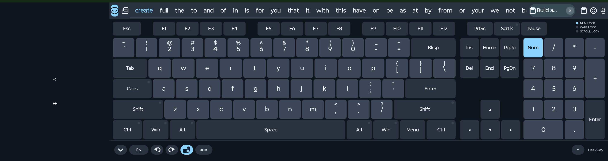

# DeskKey — Desktop style Keyboard

**Full PC layout with Alt, Ctrl, Shift & more — privacy-first, no internet.**

DeskKey is an offline virtual keyboard: a compact 104/105-key PC board with real modifiers, on-device dictionaries, clipboard history, and a settings/theme studio. Nothing is fetched from the network. There are no accounts, ads, analytics, or remote word lists.

DeskKey is freeware.

You may download, install, and use the official APK from this repository’s Releases for free.

This project is proprietary. No license is granted to copy, modify, redistribute,
or create derivative works from the source code or the APK, except as needed to
install and use the official APK.

Provided as-is, with no warranty.

## Privacy guarantees

- Android manifest does **not** request `INTERNET` or `ACCESS_NETWORK_STATE`. `RECORD_AUDIO` is used only for dictation when you turn the microphone chip on.
- Dictionaries, learned words, clipboard history, themes, and layouts stay on-device.
- **Private mode** (off by default) stops learning new words. Suggestions still use words you already learned. Clipboard history still saves system copy.
- Backup is a JSON file you save yourself. Restore brings back every setting (languages on, current language, layout, theme, IME chips), learned words, suggestion extras, clipboard, and emoji recents. No server.

## Enable as the system keyboard

### Android (signed APK included)

1. Allow “Install unknown apps” if asked.
2. **Settings → System → Languages & input → On-screen keyboard → Manage keyboards → enable DeskKey.**
3. Open any text field and switch to DeskKey from the keyboard picker.

---

## Layout

DeskKey follows a real PC 104/105 keyboard, not a phone 3-row pad.

- **Function row:** Esc, F1–F12, PrtSc, ScrLk, Pause — hide from **Settings → Layouts** or the **F / Fn** chip (off by default on phones)
- **Number row** with dual-legend shift glyphs (`!` `@` `#` `$` …). Shift types the upper symbol.
- **QWERTY / QWERTZ / AZERTY / Dk /k  / Col/ Co Colemvorak / Colemak** letter block (Tab, Caps, dual Shift, Enter, Backspace)
- **ISO Enter** option for 105-key boards
- **Bottom modifiers:** Ctrl, Win/Super, Alt, Space, Alt, Win, Menu, Ctrl
- **Navigation cluster:** Ins, Home, PgUp, Del, End, PgDn and inverted-T arrows
- **Numpad** with Num Lock, `/` `*` `-` `+`, Enter — **Pad / 123** in the More (⌃) panel hides or shows it immediately
- **Lock LEDs:** NUM LOCK, CAPS LOCK, SCROLL LOCK — hide with the F-row. Hidden while the clipboard or emoji overlay is open

---

## Full Size and Ultra Compact

**Settings → Layouts** has a radio group:

- **Full Size Keyboard** — classic PC 104/105 board (Tab, Caps, dual Shift, Enter, two Win keys, Menu).
- **Ultra Compact Keyboard** — photo-matched compact PC board. **Default on phones.** Fn row, inverted-T arrows, Ins cluster, and numpad are **off** by default on Ultra.

Ultra still has real **Ctrl / Alt / Shift / Win** combos. Shift still capitalizes letters. Sticky and lock modifiers work the same as Full Size.

**Ultra Compact details**

- Number row is `1–0` (no `` ` `` `=` keys on that row). Backspace is labeled **Bksp**.
- **Tab**, **Caps**, **Shift**, **Enter** use the same names as Full Size (not icons).
- Both Shift keys are the **same width**.
- **Win** shows the text `Win` only — no Windows logo.
- Bottom-right, between Alt and Ctrl, is **☰**. That is the OS **Menu** key (same idea as Win). On desktop it opens the field’s system context menu (right-click). On Android it sends the Menu key. It is **not** a Cut / Copy / Paste overlay.
- After **M**: a dual key with **`,`** on the key and **`/`** on top, then a dual key with **`.`** on the key and **`\`** on top.
- Every letter has a **corner symbol** (photo extras): Q `%` W `~` E `|` R `=` T `[` Y `]` U `<` I `>` O `{` P `}` A `@` S `#` D `$` F `-` G `&` H `-` J `+` K `(` L `)` Z `*` X `"` C `'` V `:` B `;` N `!` M `?`.
- **More (⌃)** has a tile to switch Full Size ↔ Ultra Compact without leaving the board.

Portrait and landscape remember height, floating, Fn/arrows/nav/numpad, and form factor **separately**.

---

## Long-press popup

Long-press a letter to open a **small even grid** above the key (equal square cells, no leftover wrapped row).

- The **corner symbol is always bottom-left** and **already selected**. Release without moving to type that symbol. You do **not** slide for the symbol.
- Next cells are the letter in the current Caps/Shift case, then **accents for that letter only** (`á à â ä æ …` on A; capitals when Shift/Caps is on).
- Slide onto another cell, then release to type it.
- Extra stash marks (for example backtick on W, `^` on N) follow the accents.

---

## Overlays (clipboard, emoji, special symbols)

Each overlay covers the key area only. At the bottom: **ABC**, Space, Backspace, Enter. ABC returns to the letter keyboard.

**Special symbols** uses fixed 42×42 keys and **scrolls**. Keys do not shrink to fit.

---

## Undo and redo

Curved-arrow chips on the IME bar, plus **Ctrl+Z** / **Ctrl+Y** / **Ctrl+Shift+Z** / **Alt+Backspace**.

Undo actually reverts what you just typed. Redo puts it back.

---

## IME bar

The bar under the keys (toggle in Settings → Appearance). Pad / 123, Fn, T-arrow, Ins, and Settings live in the **More (⌃)** panel next to the DeskKey name. Remaining chips reflow.

| Left → | Right |
|---|---|
| **▾** hide the keyboard | **⌃ More** — Pad / 123, Fn, T-arrow, Ins, Settings |
| **EN** language chip — tap for enabled languages (Settings → Languages) | **DeskKey** name |
| Extra-letter chip (when the language has extra letters) | |
| **Undo / Redo** curved-arrow chips (Ctrl+Z / Ctrl+Y) | |
| **Hand** one-handed half-width (not shown while floating) | |
| **#+=** special-symbol palette | |

Tap **▾** to hide the keyboard. Tap **⌃** for Pad, Fn, arrows, Ins, and Settings. The F-row grows **upward** so the letter rows and IME bar stay put.

---

## Suggestion bar

Left to right:

| Control | What it does |
|---|---|
| Mask | Private mode. Suggestions still use learned words; new learning is paused. |
| Float | Untether the board (see Floating). Hidden while you hide the button in Layouts. |
| Chips | **All** matching words — never truncated with “…”. Long lists scroll with a faint transparent scrollbar. Private / float / clipboard / emoji / the copied-text chip stay put. |
| Copied-text chip | After a copy, a pill to the left of the clipboard button shows the first two words and “…”. Tap to paste. Tap **×** to hide it until the next copy. Not part of the suggestion scroll. |
| Clipboard | Opens the on-device clipboard overlay. Lit while the overlay is open. |
| Emoji | Opens the emoji overlay (right of clipboard). Lit while the overlay is open. |

Password fields never show suggestions and never learn.

---

## Floating keyboard

Off by default. Turn it on from the float button next to private.

---

## Clipboard

- Opens **scrolled to the top** so the newest clips are visible. It does not jump to the middle or bottom.
- **Recent** and **Pinned** tabs sit on the **right**. Opening clipboard always lands on **Recent**.
- Recent shows unpinned copies with the newest at the top.
- Pinned shows every pinned clip, most recently pinned at the top.
- **No pin icon on cells.** Hint text sits **below** the tabs: *To pin text hold text so it will add in pinned list*. Long-press a clip to pin or unpin it.
- 3-column grid of on-device clips
- Long text is clamped to **two lines** with an ellipsis — the panel never grows taller than the keyboard
- **Space, Backspace, and Enter** sit at the bottom of clipboard / emoji / symbol overlays. They are a few pixels shorter than letter keys; Enter matches the keyboard Enter key.
- Scroll inside the overlay; deleting a clip reflows the grid
- Android system copy/cut is captured into history
- **Recent and pinned lists are unlimited.** DeskKey never auto-deletes old clips. Only you delete (Recent: swipe/clear; Pinned: unpin, then delete).
- Private mode does **not** hide clipboard
- NUM / CAPS / SCROLL LOCK LEDs are hidden while this overlay is open
- Clear (Recent tab only) removes unpinned clips

---

## Emoji

The smile button sits **to the right of clipboard**. The picker covers the **key area only** — keyboard height never grows. A long list scrolls inside the overlay.

Category tabs match a system-style emoji bar:

Recent · Smileys · People · Animals · Food · Cars · Play · Objects · Symbols · Flags · `:-)` emoticons

Recently used glyphs stay on-device (included in backup v3).

---

## Settings

Settings is five tabs: **Appearance**, **Layouts**, **Languages**, **Text correction**, **Backup**. Open Settings from the companion app, or from **More (⌃) → Settings** on the keyboard.

### Appearance

| Control | Range / default | What it does |
|---|---|---|
| Follow system light/dark | Off | Midnight in dark mode, Paper in light mode. Turn off to pick a theme in Theme studio. |
| Key height · portrait | 28–64 px, default **42** | Key row height in portrait. Saved separately from landscape. |
| Key height · landscape | 28–64 px, default **42** | Key row height in landscape. |
| Key text size | 11–18 px, default **14** | Letters and legends on keys. |
| Word suggestion text size | 11–18 px, default **13** | Suggestion chips. |
| Clipboard text size | 11–18 px, default **12** | Clip cells in the overlay. |
| Bottom padding | 0–48 px, default **8** | Space under the IME bar. |
| Side padding | 0–20 px, default **6** | Left/right inset of the board. |
| Floating transparency | 0–70%, default **0** | See-through keys **only while floating**. |
| Allow run at startup | Android companion | Opens the system battery-optimization / autostart screen so DeskKey can wake after reboot. On some phones also turn on Autostart for DeskKey. |

**Not in Appearance:** keyboard scale, key previews, bevels, key borders, haptic. Bevels and radii live in **Theme studio**.

### Layouts

**Size** (radio group)

- **Full Size Keyboard** — full PC board with punctuation keys, two Win keys, and Menu.
- **Ultra Compact Keyboard** — number row plus letter extras. **Default on phones.** Shift still capitalizes; long-press a letter for its corner symbol. Fn, arrows, Ins, and numpad stay off until you turn them on in More.

**Show / hide buttons**

Hide a button to free space on the IME bar and suggestion strip. Hidden chips reflow. **Pad / 123, Fn, T-arrow, Ins, and Settings always live in More (⌃)** — they are not in this list.

| Toggle | Default | Where it lives |
|---|---|---|
| Down arrow | On | IME bar, left of EN. Hides the keyboard. |
| Undo | On | IME bar curved-arrow undo. |
| Redo | On | IME bar curved-arrow redo. |
| Private mode | On | Mask / glasses on the suggestion bar. Private itself stays **off** until you tap the mask. |
| Floating keyboard button | On | Untether the board from the suggestion strip. Floating itself stays **off** until you tap it. |
| Clipboard | On | Clipboard history on the suggestion strip. |
| Emoji | On | Emoji picker on the suggestion strip. |
| Microphone | **Off** | Dictate chip on the suggestion strip. Uses the phone’s speech if it has it, in the selected language. |
| One-hand | On (chip shown) | Half-width keyboard with flip and resize. Hidden while floating. One-hand **mode** is off until you tap the hand. |
| Special symbols | On | #+= palette of punctuation and symbols. |

One-handed mode: the **hand** chip shrinks the board to half width. The empty side has **< / >** to flip sides and **↔** to drag-resize (about 42–82%). Side and width are saved. Not applied while floating.

**Export / Import layout JSON**.

### Languages

English is on by default. Turn other languages on to add them to the **EN** button. Tap EN, then pick with the radio list. Letters and suggestions follow that language. If a language has extra letters, a letter chip appears next to EN.

Languages in the list:

Arabic, Assamese, Bengali, Bulgarian, Catalan, Chinese, Croatian, Czech, Danish, Dutch, English, Filipino, Finnish, French, German, Greek, Gujarati, Hebrew, Hindi, Hungarian, Indonesian, Italian, Japanese, Kannada, Korean, Malay, Malayalam, Marathi, Nepali, Norwegian, Odia, Persian, Polish, Portuguese, Punjabi, Romanian, Russian, Sanskrit, Serbian, Slovak, Spanish, Swahili, Swedish, Tamil, Telugu, Thai, Turkish, Ukrainian, Urdu, Vietnamese.

At least one language must stay on (English is the fallback).

### Text correction

| Toggle | Default | What it does |
|---|---|---|
| Word suggestions | On | Prefix match from two letters. If one or two letters are wrong, the closest dictionary word is shown first. Hidden in password fields. |
| Next-word suggestions | On | After space, suggest common or learned words. Fully on-device. |
| Auto-correction | On | On space, replace a misspelled word with the closest on-device match. Off in password, URL, and email fields. |
| Auto-capitalization | On | After `.` `!` `?` **and a space**, Shift turns on for the next letter. Backspacing a period does not turn Shift on. Tap Shift off to type lowercase. URL, email, password, and number fields stay lowercase. Tapping a suggestion still capitalizes the first word or a word after a period. |
| Punctuation suggestions |
| Learn words I type. Disabled in private mode. |
| Private mode | **Off** | DeskKey does not learn new words. Suggestions still use words you already learned. Toggle from the mask on the left of the suggestion bar. Password fields never learn. |

Android companion Text correction shows: Word suggestions, Next-word, Auto-correction, Auto-capitalization, Private mode.

### Backup

JSON backup of **settings + languages (which are on and which is current) + layout + theme + IME chips + learned words + suggestion extras + clipboard clips + emoji recents**. Restore puts all of them back. Nothing is uploaded.

- **Download backup** / **Restore backup**

---

## Theme studio

Separate page from Settings. Live preview of keycaps and LEDs. Save custom presets on-device. Optional local background image. Bevels, corner radius, and colors are all offline.

Presets: **Midnight**, **Graphite**, **Paper**, **Paper contrast**, **High contrast**, **Glass**, **Ember**, **Moss**, **Glacier**, **Terminal**. Paper and Paper contrast are high-legibility light boards. Glass, Glacier, Ember, and Moss stay readable with floating transparency.

Follow system (Appearance) uses Midnight in dark mode and Paper in light mode. Picking a preset in Theme studio turns Follow system off.

---

## Support this project

If this project helped you, you can support it through UPI:

[Donate via UPI](upi://pay?pa=shubanstudio@cnrb)

UPI ID: `shubanstudio@cnrb`
